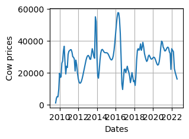

# Exploratory Data Analysis


```python
Import pandas as pd
```


```python
Dataset=pd.read_excel("Makert Prices 2022.xlsx")
```


```python
Dataset
```


<div>
<style scoped>
    .dataframe tbody tr th:only-of-type {
        vertical-align: middle;
    }

    .dataframe tbody tr th {
        vertical-align: top;
    }

    .dataframe thead th {
        text-align: right;
    }
</style>
<table border="1" class="dataframe">
  <thead>
    <tr style="text-align: right;">
      <th></th>
      <th>Dates</th>
      <th>Seasons</th>
      <th>Bull</th>
      <th>Cow</th>
      <th>Heifer</th>
      <th>Steer</th>
    </tr>
  </thead>
  <tbody>
    <tr>
      <th>0</th>
      <td>2009-08-01</td>
      <td>Drought</td>
      <td>8500.000000</td>
      <td>966.666667</td>
      <td>1666.666667</td>
      <td>766.666667</td>
    </tr>
    <tr>
      <th>1</th>
      <td>2009-09-01</td>
      <td>Drought</td>
      <td>18000.000000</td>
      <td>4000.000000</td>
      <td>15000.000000</td>
      <td>13000.000000</td>
    </tr>
    <tr>
      <th>2</th>
      <td>2009-10-01</td>
      <td>Drought</td>
      <td>8500.000000</td>
      <td>5000.000000</td>
      <td>8000.000000</td>
      <td>9000.000000</td>
    </tr>
    <tr>
      <th>3</th>
      <td>2009-11-01</td>
      <td>Drought</td>
      <td>12484.312740</td>
      <td>4815.021851</td>
      <td>5198.550137</td>
      <td>11302.715033</td>
    </tr>
    <tr>
      <th>4</th>
      <td>2009-12-01</td>
      <td>Wet</td>
      <td>22166.666667</td>
      <td>9477.777778</td>
      <td>10111.111111</td>
      <td>18222.222222</td>
    </tr>
    <tr>
      <th>...</th>
      <td>...</td>
      <td>...</td>
      <td>...</td>
      <td>...</td>
      <td>...</td>
      <td>...</td>
    </tr>
    <tr>
      <th>149</th>
      <td>2022-01-01</td>
      <td>dry</td>
      <td>69500.000000</td>
      <td>35000.000000</td>
      <td>27500.000000</td>
      <td>65000.000000</td>
    </tr>
    <tr>
      <th>150</th>
      <td>2022-03-10</td>
      <td>dry</td>
      <td>65000.000000</td>
      <td>33000.000000</td>
      <td>21500.000000</td>
      <td>57500.000000</td>
    </tr>
    <tr>
      <th>151</th>
      <td>2022-04-15</td>
      <td>dry</td>
      <td>57500.000000</td>
      <td>22500.000000</td>
      <td>14500.000000</td>
      <td>50000.000000</td>
    </tr>
    <tr>
      <th>152</th>
      <td>2022-05-20</td>
      <td>dry</td>
      <td>40000.000000</td>
      <td>20000.000000</td>
      <td>10000.000000</td>
      <td>30000.000000</td>
    </tr>
    <tr>
      <th>153</th>
      <td>2022-07-29</td>
      <td>dry</td>
      <td>55000.000000</td>
      <td>16000.000000</td>
      <td>6500.000000</td>
      <td>40000.000000</td>
    </tr>
  </tbody>
</table>
<p>154 rows × 6 columns</p>
</div>


```python
Dataset.info()
#Dates in the required formats
```

    <class 'pandas.core.frame.DataFrame'>
    RangeIndex: 154 entries, 0 to 153
    Data columns (total 6 columns):
     #   Column   Non-Null Count  Dtype         
    ---  ------   --------------  -----         
     0   Dates    154 non-null    datetime64[ns]
     1   Seasons  154 non-null    object        
     2   Bull     154 non-null    float64       
     3   Cow      154 non-null    float64       
     4   Heifer   154 non-null    float64       
     5   Steer    154 non-null    float64       
    dtypes: datetime64[ns](1), float64(4), object(1)
    memory usage: 7.3+ KB
    


```python
Dataset.head()
```


<div>
<style scoped>
    .dataframe tbody tr th:only-of-type {
        vertical-align: middle;
    }

    .dataframe tbody tr th {
        vertical-align: top;
    }

    .dataframe thead th {
        text-align: right;
    }
</style>
<table border="1" class="dataframe">
  <thead>
    <tr style="text-align: right;">
      <th></th>
      <th>Dates</th>
      <th>Seasons</th>
      <th>Bull</th>
      <th>Cow</th>
      <th>Heifer</th>
      <th>Steer</th>
    </tr>
  </thead>
  <tbody>
    <tr>
      <th>0</th>
      <td>2009-08-01</td>
      <td>Drought</td>
      <td>8500.000000</td>
      <td>966.666667</td>
      <td>1666.666667</td>
      <td>766.666667</td>
    </tr>
    <tr>
      <th>1</th>
      <td>2009-09-01</td>
      <td>Drought</td>
      <td>18000.000000</td>
      <td>4000.000000</td>
      <td>15000.000000</td>
      <td>13000.000000</td>
    </tr>
    <tr>
      <th>2</th>
      <td>2009-10-01</td>
      <td>Drought</td>
      <td>8500.000000</td>
      <td>5000.000000</td>
      <td>8000.000000</td>
      <td>9000.000000</td>
    </tr>
    <tr>
      <th>3</th>
      <td>2009-11-01</td>
      <td>Drought</td>
      <td>12484.312740</td>
      <td>4815.021851</td>
      <td>5198.550137</td>
      <td>11302.715033</td>
    </tr>
    <tr>
      <th>4</th>
      <td>2009-12-01</td>
      <td>Wet</td>
      <td>22166.666667</td>
      <td>9477.777778</td>
      <td>10111.111111</td>
      <td>18222.222222</td>
    </tr>
  </tbody>
</table>
</div>


```python
Dataset.tail()
```


<div>
<style scoped>
    .dataframe tbody tr th:only-of-type {
        vertical-align: middle;
    }

    .dataframe tbody tr th {
        vertical-align: top;
    }

    .dataframe thead th {
        text-align: right;
    }
</style>
<table border="1" class="dataframe">
  <thead>
    <tr style="text-align: right;">
      <th></th>
      <th>Dates</th>
      <th>Seasons</th>
      <th>Bull</th>
      <th>Cow</th>
      <th>Heifer</th>
      <th>Steer</th>
    </tr>
  </thead>
  <tbody>
    <tr>
      <th>149</th>
      <td>2022-01-01</td>
      <td>dry</td>
      <td>69500.0</td>
      <td>35000.0</td>
      <td>27500.0</td>
      <td>65000.0</td>
    </tr>
    <tr>
      <th>150</th>
      <td>2022-03-10</td>
      <td>dry</td>
      <td>65000.0</td>
      <td>33000.0</td>
      <td>21500.0</td>
      <td>57500.0</td>
    </tr>
    <tr>
      <th>151</th>
      <td>2022-04-15</td>
      <td>dry</td>
      <td>57500.0</td>
      <td>22500.0</td>
      <td>14500.0</td>
      <td>50000.0</td>
    </tr>
    <tr>
      <th>152</th>
      <td>2022-05-20</td>
      <td>dry</td>
      <td>40000.0</td>
      <td>20000.0</td>
      <td>10000.0</td>
      <td>30000.0</td>
    </tr>
    <tr>
      <th>153</th>
      <td>2022-07-29</td>
      <td>dry</td>
      <td>55000.0</td>
      <td>16000.0</td>
      <td>6500.0</td>
      <td>40000.0</td>
    </tr>
  </tbody>
</table>
</div>


```python
#Data description
Dataset.describe()
```


<div>
<style scoped>
    .dataframe tbody tr th:only-of-type {
        vertical-align: middle;
    }

    .dataframe tbody tr th {
        vertical-align: top;
    }

    .dataframe thead th {
        text-align: right;
    }
</style>
<table border="1" class="dataframe">
  <thead>
    <tr style="text-align: right;">
      <th></th>
      <th>Dates</th>
      <th>Bull</th>
      <th>Cow</th>
      <th>Heifer</th>
      <th>Steer</th>
    </tr>
  </thead>
  <tbody>
    <tr>
      <th>count</th>
      <td>154</td>
      <td>154.000000</td>
      <td>154.000000</td>
      <td>154.000000</td>
      <td>154.000000</td>
    </tr>
    <tr>
      <th>mean</th>
      <td>2015-12-17 21:30:23.376623360</td>
      <td>53296.236208</td>
      <td>28102.985031</td>
      <td>23831.001561</td>
      <td>41550.111140</td>
    </tr>
    <tr>
      <th>min</th>
      <td>2009-08-01 00:00:00</td>
      <td>8500.000000</td>
      <td>966.666667</td>
      <td>1666.666667</td>
      <td>766.666667</td>
    </tr>
    <tr>
      <th>25%</th>
      <td>2012-10-08 18:00:00</td>
      <td>45100.000000</td>
      <td>21780.739223</td>
      <td>15083.333333</td>
      <td>37421.703386</td>
    </tr>
    <tr>
      <th>50%</th>
      <td>2015-12-16 12:00:00</td>
      <td>56503.850527</td>
      <td>29150.409072</td>
      <td>24461.740493</td>
      <td>41150.249088</td>
    </tr>
    <tr>
      <th>75%</th>
      <td>2019-02-22 00:00:00</td>
      <td>62417.575150</td>
      <td>33659.749804</td>
      <td>29975.666924</td>
      <td>46531.278194</td>
    </tr>
    <tr>
      <th>max</th>
      <td>2022-07-29 00:00:00</td>
      <td>78000.000000</td>
      <td>57613.001040</td>
      <td>50000.000000</td>
      <td>65411.537154</td>
    </tr>
    <tr>
      <th>std</th>
      <td>NaN</td>
      <td>13837.139183</td>
      <td>9973.969461</td>
      <td>10485.280024</td>
      <td>10678.454015</td>
    </tr>
  </tbody>
</table>
</div>


```python
#Check for the unique values
Dataset.nunique()
```


    Dates      154
    Seasons      6
    Bull       135
    Cow        135
    Heifer     137
    Steer      139
    dtype: int64


```python
Dataset["Dates"].unique()

```


    <DatetimeArray>
    ['2009-08-01 00:00:00', '2009-09-01 00:00:00', '2009-10-01 00:00:00',
     '2009-11-01 00:00:00', '2009-12-01 00:00:00', '2010-01-01 00:00:00',
     '2010-02-01 00:00:00', '2010-03-01 00:00:00', '2010-04-01 00:00:00',
     '2010-05-01 00:00:00',
     ...
     '2021-08-01 00:00:00', '2021-09-01 00:00:00', '2021-10-01 00:00:00',
     '2021-11-01 00:00:00', '2021-12-01 00:00:00', '2022-01-01 00:00:00',
     '2022-03-10 00:00:00', '2022-04-15 00:00:00', '2022-05-20 00:00:00',
     '2022-07-29 00:00:00']
    Length: 154, dtype: datetime64[ns]


```python
Dataset["Seasons"].unique()

```


    array(['Drought', 'Wet', 'Dry', 'dry', 'drought', 'wet'], dtype=object)


```python
#Cleaning the data
#Check for null values and get sum
```


```python
Dataset.isnull().sum
```


    <bound method NDFrame._add_numeric_operations.<locals>.sum of      Dates  Seasons   Bull    Cow  Heifer  Steer
    0    False    False  False  False   False  False
    1    False    False  False  False   False  False
    2    False    False  False  False   False  False
    3    False    False  False  False   False  False
    4    False    False  False  False   False  False
    ..     ...      ...    ...    ...     ...    ...
    149  False    False  False  False   False  False
    150  False    False  False  False   False  False
    151  False    False  False  False   False  False
    152  False    False  False  False   False  False
    153  False    False  False  False   False  False
    
    [154 rows x 6 columns]>


```python
import pandas as pd
import numpy as np
import seaborn as sns
import matplotlib.pyplot as plt
%matplotlib inline
```


```python
sns.pairplot(Dataset)
```

    C:\Users\USER\anaconda3\Lib\site-packages\seaborn\axisgrid.py:118: UserWarning: The figure layout has changed to tight
      self._figure.tight_layout(*args, **kwargs)
    


    <seaborn.axisgrid.PairGrid at 0x217945e4ed0>


    

    


# Model Fitting


```python
#Model Testing
#Import Machine Learning libraries
from sklearn.model_selection import train_test_split
from sklearn.linear_model import LinearRegression
from sklearn.metrics import mean_squared_error


```


```python
#An assumption that 'Dates' is in date time format
Dataset['Dates']=pd.to_datetime(Dataset['Dates'])
```

# Model visualization and predictions


```python
df=pd.read_excel("Makert Prices 2022.xlsx")
```


```python
df
```


<div>
<style scoped>
    .dataframe tbody tr th:only-of-type {
        vertical-align: middle;
    }

    .dataframe tbody tr th {
        vertical-align: top;
    }

    .dataframe thead th {
        text-align: right;
    }
</style>
<table border="1" class="dataframe">
  <thead>
    <tr style="text-align: right;">
      <th></th>
      <th>Dates</th>
      <th>Seasons</th>
      <th>Bull</th>
      <th>Cow</th>
      <th>Heifer</th>
      <th>Steer</th>
    </tr>
  </thead>
  <tbody>
    <tr>
      <th>0</th>
      <td>2009-08-01</td>
      <td>Drought</td>
      <td>8500.000000</td>
      <td>966.666667</td>
      <td>1666.666667</td>
      <td>766.666667</td>
    </tr>
    <tr>
      <th>1</th>
      <td>2009-09-01</td>
      <td>Drought</td>
      <td>18000.000000</td>
      <td>4000.000000</td>
      <td>15000.000000</td>
      <td>13000.000000</td>
    </tr>
    <tr>
      <th>2</th>
      <td>2009-10-01</td>
      <td>Drought</td>
      <td>8500.000000</td>
      <td>5000.000000</td>
      <td>8000.000000</td>
      <td>9000.000000</td>
    </tr>
    <tr>
      <th>3</th>
      <td>2009-11-01</td>
      <td>Drought</td>
      <td>12484.312740</td>
      <td>4815.021851</td>
      <td>5198.550137</td>
      <td>11302.715033</td>
    </tr>
    <tr>
      <th>4</th>
      <td>2009-12-01</td>
      <td>Wet</td>
      <td>22166.666667</td>
      <td>9477.777778</td>
      <td>10111.111111</td>
      <td>18222.222222</td>
    </tr>
    <tr>
      <th>...</th>
      <td>...</td>
      <td>...</td>
      <td>...</td>
      <td>...</td>
      <td>...</td>
      <td>...</td>
    </tr>
    <tr>
      <th>149</th>
      <td>2022-01-01</td>
      <td>dry</td>
      <td>69500.000000</td>
      <td>35000.000000</td>
      <td>27500.000000</td>
      <td>65000.000000</td>
    </tr>
    <tr>
      <th>150</th>
      <td>2022-03-10</td>
      <td>dry</td>
      <td>65000.000000</td>
      <td>33000.000000</td>
      <td>21500.000000</td>
      <td>57500.000000</td>
    </tr>
    <tr>
      <th>151</th>
      <td>2022-04-15</td>
      <td>dry</td>
      <td>57500.000000</td>
      <td>22500.000000</td>
      <td>14500.000000</td>
      <td>50000.000000</td>
    </tr>
    <tr>
      <th>152</th>
      <td>2022-05-20</td>
      <td>dry</td>
      <td>40000.000000</td>
      <td>20000.000000</td>
      <td>10000.000000</td>
      <td>30000.000000</td>
    </tr>
    <tr>
      <th>153</th>
      <td>2022-07-29</td>
      <td>dry</td>
      <td>55000.000000</td>
      <td>16000.000000</td>
      <td>6500.000000</td>
      <td>40000.000000</td>
    </tr>
  </tbody>
</table>
<p>154 rows × 6 columns</p>
</div>


```python
df.info()
```

    <class 'pandas.core.frame.DataFrame'>
    RangeIndex: 154 entries, 0 to 153
    Data columns (total 6 columns):
     #   Column   Non-Null Count  Dtype         
    ---  ------   --------------  -----         
     0   Dates    154 non-null    datetime64[ns]
     1   Seasons  154 non-null    object        
     2   Bull     154 non-null    float64       
     3   Cow      154 non-null    float64       
     4   Heifer   154 non-null    float64       
     5   Steer    154 non-null    float64       
    dtypes: datetime64[ns](1), float64(4), object(1)
    memory usage: 7.3+ KB
    


```python
New Analysis
#we covert 'dates' times into a pandas dataframe

```


```python
from datetime import datetime
```


```python
df
```


<div>
<style scoped>
    .dataframe tbody tr th:only-of-type {
        vertical-align: middle;
    }

    .dataframe tbody tr th {
        vertical-align: top;
    }

    .dataframe thead th {
        text-align: right;
    }
</style>
<table border="1" class="dataframe">
  <thead>
    <tr style="text-align: right;">
      <th></th>
      <th>Dates</th>
      <th>Seasons</th>
      <th>Bull</th>
      <th>Cow</th>
      <th>Heifer</th>
      <th>Steer</th>
    </tr>
  </thead>
  <tbody>
    <tr>
      <th>0</th>
      <td>2009-08-01</td>
      <td>Drought</td>
      <td>8500.000000</td>
      <td>966.666667</td>
      <td>1666.666667</td>
      <td>766.666667</td>
    </tr>
    <tr>
      <th>1</th>
      <td>2009-09-01</td>
      <td>Drought</td>
      <td>18000.000000</td>
      <td>4000.000000</td>
      <td>15000.000000</td>
      <td>13000.000000</td>
    </tr>
    <tr>
      <th>2</th>
      <td>2009-10-01</td>
      <td>Drought</td>
      <td>8500.000000</td>
      <td>5000.000000</td>
      <td>8000.000000</td>
      <td>9000.000000</td>
    </tr>
    <tr>
      <th>3</th>
      <td>2009-11-01</td>
      <td>Drought</td>
      <td>12484.312740</td>
      <td>4815.021851</td>
      <td>5198.550137</td>
      <td>11302.715033</td>
    </tr>
    <tr>
      <th>4</th>
      <td>2009-12-01</td>
      <td>Wet</td>
      <td>22166.666667</td>
      <td>9477.777778</td>
      <td>10111.111111</td>
      <td>18222.222222</td>
    </tr>
    <tr>
      <th>...</th>
      <td>...</td>
      <td>...</td>
      <td>...</td>
      <td>...</td>
      <td>...</td>
      <td>...</td>
    </tr>
    <tr>
      <th>149</th>
      <td>2022-01-01</td>
      <td>dry</td>
      <td>69500.000000</td>
      <td>35000.000000</td>
      <td>27500.000000</td>
      <td>65000.000000</td>
    </tr>
    <tr>
      <th>150</th>
      <td>2022-03-10</td>
      <td>dry</td>
      <td>65000.000000</td>
      <td>33000.000000</td>
      <td>21500.000000</td>
      <td>57500.000000</td>
    </tr>
    <tr>
      <th>151</th>
      <td>2022-04-15</td>
      <td>dry</td>
      <td>57500.000000</td>
      <td>22500.000000</td>
      <td>14500.000000</td>
      <td>50000.000000</td>
    </tr>
    <tr>
      <th>152</th>
      <td>2022-05-20</td>
      <td>dry</td>
      <td>40000.000000</td>
      <td>20000.000000</td>
      <td>10000.000000</td>
      <td>30000.000000</td>
    </tr>
    <tr>
      <th>153</th>
      <td>2022-07-29</td>
      <td>dry</td>
      <td>55000.000000</td>
      <td>16000.000000</td>
      <td>6500.000000</td>
      <td>40000.000000</td>
    </tr>
  </tbody>
</table>
<p>154 rows × 6 columns</p>
</div>


```python
df.info()
```

    <class 'pandas.core.frame.DataFrame'>
    RangeIndex: 154 entries, 0 to 153
    Data columns (total 6 columns):
     #   Column   Non-Null Count  Dtype         
    ---  ------   --------------  -----         
     0   Dates    154 non-null    datetime64[ns]
     1   Seasons  154 non-null    object        
     2   Bull     154 non-null    float64       
     3   Cow      154 non-null    float64       
     4   Heifer   154 non-null    float64       
     5   Steer    154 non-null    float64       
    dtypes: datetime64[ns](1), float64(4), object(1)
    memory usage: 7.3+ KB
    


```python
#Ploting trends over time
```


```python
#Plotting bull prices over time
```


```python
plt.subplot(2,2,1)
plt.plot(df['Dates'], df['Bull'])
plt.xlabel('Dates')
plt.ylabel('Bull prices')
plt.grid(True)

```


    

    


```python
#Plotting cow prices over time
```


```python
plt.subplot(2,2,2)
plt.plot(df['Dates'], df['Cow'])
plt.xlabel('Dates')
plt.ylabel('Cow prices')
plt.grid(True)
```


    

    


```python
#plotting Heifer prices over time
```


```python
plt.subplot(2,2,3)
plt.plot(df['Dates'], df['Heifer'])
plt.xlabel('Dates')
plt.ylabel('Heifer Prices')
plt.grid(True)
```


    

    


```python
#Plotting steer prices over time
```


```python
plt.subplot(2,2,4)
plt.plot(df['Dates'], df['Steer'])
plt.xlabel('Dates')
plt.ylabel('Steer prices')
plt.grid(True)
```


    

    


```python
plt.tight_layout()
plt.show()
```


    <Figure size 640x480 with 0 Axes>


```python
#Average prices of each of the category
```


```python
average_prices=df[['Bull', 'Cow', 'Heifer', 'Steer']].mean()
```


```python
print("\nAverage Prices:")
print(average_prices)
```

    
    Average Prices:
    Bull      53296.236208
    Cow       28102.985031
    Heifer    23831.001561
    Steer     41550.111140
    dtype: float64
    


```python
#Maximum and Minimum Prices
max_prices=df[['Bull', 'Cow', 'Heifer', 'Steer']].max()
min_prices=df[['Bull', 'Cow', 'Heifer', 'Steer']].min()
```


```python
print("\nMaximum Prices:")
print(max_prices)
print("\nMinimum Prices:")
print(min_prices)
```

    
    Maximum Prices:
    Bull      78000.000000
    Cow       57613.001040
    Heifer    50000.000000
    Steer     65411.537154
    dtype: float64
    
    Minimum Prices:
    Bull      8500.000000
    Cow        966.666667
    Heifer    1666.666667
    Steer      766.666667
    dtype: float64
    


```python
#Advantages and disdvantages of selling at specific points
#Advantages
1. selling livestock at wet seasons generate more income than in dry seasons.
2. At any point, both bull and cow have a higher demand due to their ability to survive in wet and dry conditions
#Disadvantages 
1.Decrease in demand during the dry seasons
2.Decline in prices during the dry seasons
#Benefits of selling Earlier
1. It generates more income to the livestock keepers
2. It reduces losses that could have been incurred in cases of deaths during the dry seasons.
3. Selling earlier enables the livestock keepers to reach new markets with potential customers for better prices
```
